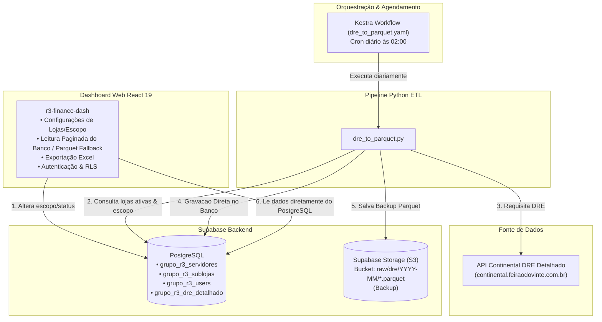

# 📊 Documentação Completa do Projeto: Grupo R3 API & Financial Dashboard

Este repositório contém a **solução ponta a ponta de engenharia de dados e plataforma de gestão financeira do Grupo R3**. O sistema é responsável por automatizar a extração do **DRE Detalhado** (Demonstrativo do Resultado do Exercício) de dezenas de lojas matrizes e filiais, converter e otimizar esses dados em formato **Parquet**, armazená-los no **Supabase Storage (S3)** e disponibilizar uma **Interface Web (Dashboard)** moderna para gestão do escopo de extração, auditoria e leitura dos dados.

---

## 🏗️ 1. Arquitetura Geral do Sistema

A solução foi projetada em uma arquitetura desacoplada e escalável, integrando pipeline ETL em Python, orquestrador de tarefas Kestra, banco de dados PostgreSQL/Storage Supabase e um frontend em React 19.



---

## 🔍 2. Componentes em Detalhes

### 🐍 2.1. Pipeline de Extração ETL (`dre_to_parquet.py`)
O script [dre_to_parquet.py](file:///c:/Users/LucasVitorino/Documents/grupo-r3-api/dre_to_parquet.py) é o motor de ingestão de dados.

- **Busca Dinâmica de Tarefas (`fetch_tarefas_supabase`)**:
  Conecta-se à API REST do Supabase para consultar as matrizes ativas (`grupo_r3_servidores`) e filiais ativas (`grupo_r3_sublojas`).
- **Resolução Flexível de Escopo**:
  - **Histórico Completo (`carga_completa = true`)**: Extrai todos os meses desde `2025-01-01` até o mês atual.
  - **Mês Específico (`mes_referencia = "YYYY-MM"`)**: Extrai exatamente o mês definido no painel de controle.
  - **Mês Atual (Default)**: Processa o mês vigente.
- **Resiliência e Tolerância a Falhas**:
  - Tratamento automático de *Rate Limit* (HTTP 429) com retentativas e *backoff*.
  - Tratamento de instabilidade no servidor (HTTP 500, 502, 503, 504).
  - Pausas amigáveis entre requisições para evitar sobrecarga na API origem.
- **Transformação e Normalização (`pyarrow` / `pandas`)**:
  - Padroniza tipos numéricos (`debito`, `credito`, `valorLiquido`).
  - Adiciona colunas de contexto: `id_servidor`, `loja`, `id_cidade`, `cidade`.
  - Converte os dados sanitizados para o formato binário compactado **Parquet**.
- **Destino do Armazenamento**:
  - Envia via SDK `boto3` para o Supabase Storage (compatível com S3) sob a estrutura de chaves:  
    `raw/dre/{YYYY-MM}/dre_detalhado_{servidor}_{cidade}_{inicio}_{fim}.parquet`
  - Possui suporte a *fallback* local salvando em `./output_parquet/` caso credenciais de S3 estejam ausentes.

---

### ⏱️ 2.2. Orquestração no Kestra (`dre_to_parquet.yaml`)
O fluxo [dre_to_parquet.yaml](file:///c:/Users/LucasVitorino/Documents/grupo-r3-api/dre_to_parquet.yaml) gerencia a execução automatizada.

- **Agendamento**: Executado automaticamente todos os dias às **02:00 da manhã** (`cron: "0 2 * * *"`).
- **Ambiente Isolado**: Roda em um container Docker (`ghcr.io/kestra-io/pydata:latest`).
- **Gestão de Segredos**: Injeta credenciais de forma segura através do cofre de chaves (*Key-Value KV*) do Kestra:
  - `DRE_API_KEY`, `DRE_CLIENT_ID`, `DRE_CLIENT_SECRET` (Cloudflare Access e API Key)
  - `SUPABASE_ACCESS_KEY_ID`, `SUPABASE_SECRET_ACCESS_KEY`, `SUPABASE_BUCKET`, `SUPABASE_S3_ENDPOINT`, `SUPABASE_API_KEY`
- **Deploy Sem Necessidade de Rebuild**: Baixa o código fonte e as dependências diretamente da branch `main` do GitHub antes de executar, garantindo que alterações no Python entrem em produção imediatamente.

---

### 🗄️ 2.3. Banco de Dados & Segurança (`supabase_config_lojas.sql` e RLS)
O script SQL [supabase_r3_tables.sql](file:///c:/Users/LucasVitorino/Documents/grupo-r3-api/supabase_r3_tables.sql) modela a estrutura relacional no Supabase PostgreSQL:

1. **`grupo_r3_servidores` (Lojas Matrizes)**:
   - `servidor_id` (PK, INT): ID do servidor de banco da loja matriz.
   - `nome` (TEXT): Nome comercial da matriz (ex: Santa Quitéria, Guaraciaba, Crateús, Sobral, Tianguá).
   - `ativo` (BOOLEAN): Controla se a pipeline deve processar essa matriz.
   - `carga_completa` (BOOLEAN): Define se fará a carga de todo o histórico (desde 2025).
   - `mes_referencia` (VARCHAR(7)): Mês de referência no formato `YYYY-MM`.
2. **`grupo_r3_sublojas` (Filiais / Cidades)**:
   - `cidade_id` (PK, INT): ID da filial/cidade.
   - `servidor_id` (FK -> `grupo_r3_servidores`): Associação com a matriz correspondente.
   - `nome` (TEXT): Nome da subloja/cidade (ex: Nova Russas, Monsenhor Tabosa, Ipueiras).
   - `ativo`, `carga_completa`, `mes_referencia`: Configurações independentes por subloja.
3. **Segurança e Roles (Row Level Security - RLS)**:
   - Tabela `grupo_r3_users` vinculada ao `auth.users` do Supabase.
   - Políticas RLS (`fix_rls.sql`, `fix_rls_lojas.sql`, `fix_storage_policies.sql`) garantindo que apenas usuários com nível `admin` possam inserir, alterar ou deletar lojas e sublojas.

---

### 💻 2.4. Dashboard Web Financeiro (`r3-finance-dash`)
Localizado na pasta [r3-finance-dash/](file:///c:/Users/LucasVitorino/Documents/grupo-r3-api/r3-finance-dash/), o aplicativo web é a interface central de gestão e análise.

- **Tecnologias Utilizadas**:
  - **React 19** + **Vite**
  - **TanStack Start & TanStack Router** (Roteamento tipado por rotas)
  - **TanStack Query** (React Query para cache e estado assíncrono)
  - **Tailwind CSS v4** + **shadcn/ui** + **Lucide Icons**
  - **Apache Arrow** (`apache-arrow`) para parsing de arquivos Parquet em memória diretamente no navegador.
  - **SheetJS / XLSX** (`xlsx`) para exportação dos relatórios.
- **Principais Páginas & Funcionalidades**:
  - 🔑 **Autenticação (`/auth`)**: Sistema de login integrado ao Supabase Auth.
  - ⚙️ **Configurações de Lojas ([_app.configuracoes.tsx](file:///c:/Users/LucasVitorino/Documents/grupo-r3-api/r3-finance-dash/src/routes/_app.configuracoes.tsx))**:
    - Árvore interativa exibindo Matrizes e suas Sublojas aninhadas.
    - Switches para ativar/desativar lojas instantaneamente.
    - Seleção de escopo de extração (`Histórico Completo` vs `Mês Específico` via date picker mensal).
    - Modal para cadastro de novas Matrizes e Sublojas (restrito a `admin`).
    - Filtros dinâmicos por nome e por status (ativas/inativas).
  - 📊 **Catálogo & Tabela DRE ([_app.catalogo.tsx](file:///c:/Users/LucasVitorino/Documents/grupo-r3-api/r3-finance-dash/src/routes/_app.catalogo.tsx) e [_app.catalogo-tabela.tsx](file:///c:/Users/LucasVitorino/Documents/grupo-r3-api/r3-finance-dash/src/routes/_app.catalogo-tabela.tsx))**:
    - Navegação pelos arquivos `.parquet` gerados pela pipeline no Supabase Storage.
    - Tabela de dados interativa (TanStack Table) com paginação, busca global, ordenação e filtros por coluna.
    - Leitura direta em memória via **Apache Arrow**, eliminando a necessidade de um backend tradicional para processar grandes volumes de dados.
    - Exportação simplificada para planilha Excel (`.xlsx`).
  - 🪵 **Logs de Sistema ([_app.logs.tsx](file:///c:/Users/LucasVitorino/Documents/grupo-r3-api/r3-finance-dash/src/routes/_app.logs.tsx))**: Visualização de status e auditoria da operação.

---

## 🚀 3. Guia de Execução Local

### 1️⃣ Rodar a Pipeline Python
```bash
# 1. Acesse a raiz do repositório
cd c:\Users\LucasVitorino\Documents\grupo-r3-api

# 2. Crie e ative o ambiente virtual
python -m venv .venv
# No Windows PowerShell:
.\.venv\Scripts\Activate.ps1

# 3. Instale as dependências
pip install -r requirements.txt

# 4. Configure as variáveis de ambiente no seu terminal ou arquivo .env:
# DRE_API_KEY, DRE_CLIENT_ID, DRE_CLIENT_SECRET, SUPABASE_S3_ENDPOINT, SUPABASE_API_KEY, etc.

# 5. Execute o script
python dre_to_parquet.py
```
*Caso as credenciais do Supabase não estejam presentes, os arquivos `.parquet` serão salvos na pasta local `./output_parquet/`.*

---

### 2️⃣ Rodar o Dashboard Web
```bash
# 1. Acesse a pasta do dashboard
cd r3-finance-dash

# 2. Crie o arquivo .env com as credenciais do Supabase
# VITE_SUPABASE_URL=https://sua-url.supabase.co
# VITE_SUPABASE_PUBLISHABLE_KEY=sua-chave-anon

# 3. Instale as dependências
npm install

# 4. Inicie o servidor de desenvolvimento
npm run dev
```
O dashboard estará acessível em `http://localhost:3000`.

---

## 📌 Resumo da Estrutura de Arquivos

```
grupo-r3-api/
├── dre_to_parquet.py           # Pipeline ETL Python principal
├── dre_to_parquet.yaml         # Flow de Orquestração para o Kestra
├── requirements.txt            # Dependências Python (pandas, pyarrow, boto3, requests)
├── supabase_r3_tables.sql      # Script SQL de criação de todas as tabelas e permissões
├── teste_datas.py              # Script utilitário para testes de lógica de datas
├── README.md                   # Documentação resumida do projeto
└── r3-finance-dash/            # Aplicação Frontend React
    ├── src/
    │   ├── routes/             # Rotas TanStack Router (configurações, catálogo, logs, auth)
    │   ├── components/         # Componentes React + UI shadcn
    │   └── integrations/       # Cliente Supabase e tipos
    ├── package.json            # Dependências Node.js
    ├── vite.config.ts          # Configuração do Vite
    └── vercel.json             # Configuração para deploy na Vercel
```

---

*Documentação gerada para o projeto **Grupo R3 API & Dashboard Financeiro**.*
