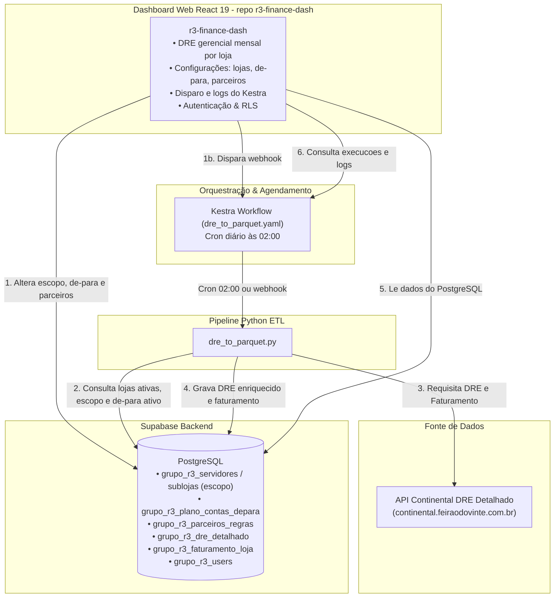

# 📊 Documentação Completa do Projeto: Grupo R3 API & Financial Dashboard

A solução de engenharia de dados e gestão financeira do Grupo R3 é composta por **dois repositórios**:

| Repositório | Papel |
|---|---|
| `grupo-r3-api` (este) | ETL Python que extrai o **DRE Detalhado** e o **Faturamento por Loja** da API Continental e grava direto no PostgreSQL do Supabase. Orquestrado pelo Kestra. |
| [`r3-finance-dash`](https://github.com/scoretecnologia/r3-finance-dash) | Dashboard web (React 19 + TanStack Start) que lê essas tabelas, monta a DRE gerencial, gerencia o escopo de extração, o de-para do plano de contas e as comissões de parceiros, e dispara/acompanha o Kestra. |

> Histórico: a primeira versão gravava arquivos Parquet no Supabase Storage. Desde a migração para
> gravação direta no PostgreSQL o Storage não é mais usado pelo ETL.

---

## 🏗️ 1. Arquitetura Geral do Sistema

A solução foi projetada em uma arquitetura desacoplada e escalável, integrando pipeline ETL em Python, orquestrador de tarefas Kestra, banco de dados PostgreSQL no Supabase e um frontend em React 19 (repositório separado).


```mermaid
flowchart TD
    subgraph API_Externa [Fonte de Dados]
        DRE["API Continental DRE Detalhado\n(continental.feiraodovinte.com.br)"]
    end

    subgraph Orquestracao [Orquestração & Agendamento]
        Kestra["Kestra Workflow (dre_to_parquet.yaml)\nCron diário às 02:00"]
    end

    subgraph ETL [Pipeline Python ETL]
        Script["dre_to_parquet.py"]
    end

    subgraph Supabase [Supabase Backend]
        DB[("PostgreSQL\n• grupo_r3_servidores / sublojas (escopo)\n• grupo_r3_plano_contas_depara\n• grupo_r3_parceiros_regras\n• grupo_r3_dre_detalhado\n• grupo_r3_faturamento_loja\n• grupo_r3_users")]
    end

    subgraph Frontend [Dashboard Web React 19 - repo r3-finance-dash]
        Dash["r3-finance-dash\n• DRE gerencial mensal por loja\n• Configurações: lojas, de-para, parceiros\n• Disparo e logs do Kestra\n• Autenticação & RLS"]
    end

    %% Fluxos
    Kestra -->|Cron 02:00 ou webhook| Script
    Dash -->|1. Altera escopo, de-para e parceiros| DB
    Dash -->|1b. Dispara webhook| Kestra
    Script -->|2. Consulta lojas ativas, escopo e de-para ativo| DB
    Script -->|3. Requisita DRE e Faturamento| DRE
    Script -->|4. Grava DRE enriquecido e faturamento| DB
    Dash -->|5. Le dados do PostgreSQL| DB
    Dash -->|6. Consulta execucoes e logs| Kestra
```

---

## 🔍 2. Componentes em Detalhes

### 🐍 2.1. Pipeline de Extração ETL (`dre_to_parquet.py`)
O script [dre_to_parquet.py](dre_to_parquet.py) é o motor de ingestão de dados.

- **Busca Dinâmica de Tarefas (`fetch_tarefas_supabase`)**:
  Conecta-se à API REST do Supabase para consultar as matrizes ativas (`grupo_r3_servidores`) e filiais ativas (`grupo_r3_sublojas`).
- **Resolução Flexível de Escopo**:
  - **Histórico Completo (`carga_completa = true`)**: Extrai todos os meses desde `2025-01-01` até o mês atual.
  - **Mês Específico (`mes_referencia = "YYYY-MM"`)**: Extrai exatamente o mês definido no painel de controle.
  - **Mês Atual (Default)**: Processa o mês vigente.
- **Resiliência e Tolerância a Falhas**:
  - Tratamento automático de *Rate Limit* (HTTP 429) com retentativas e *backoff*.
  - Tratamento de instabilidade no servidor (HTTP 500, 502, 503, 504).
  - Pausas amigáveis entre requisições para evitar sobrecarga na API origem.
- **Transformação e Enriquecimento (`pandas`)**:
  - Padroniza tipos numéricos (`debito`, `credito`, `valorLiquido`).
  - Adiciona colunas de contexto: `id_servidor`, `loja`, `id_cidade`, `cidade`.
  - Aplica o **de-para do plano de contas** (`grupo_r3_plano_contas_depara`, somente regras com `ativo = true`): casa `descricao_conta` com `conta_origem` após normalizar (trim, espaços simples, maiúsculas) e preenche `conta_padronizada`, `grupo_dre` e `natureza`. Sem regra, cai em "Despesas Administrativas" / "Despesa Fixa".
  - Campos não mapeados da API vão para `dados_extra` (JSONB).
- **Gravação idempotente no PostgreSQL (API REST do Supabase)**:
  - Transforma tudo primeiro; só então apaga os registros da mesma loja/período e insere em lotes de 500.
  - Faturamento: um registro por loja/período em `grupo_r3_faturamento_loja`.
  - Uma loja com falha é registrada no log e não interrompe as demais; a execução termina com código 1 para o Kestra sinalizar.
- **Sobrescritas do Kestra** (`KESTRA_SERVIDOR_ID`, `KESTRA_CIDADE_ID`, `KESTRA_MES_REFERENCIA`, `KESTRA_CARGA_COMPLETA`):
  restringem o escopo e o período. Com `mes_referencia` vazio e `carga_completa` falso, vale a configuração de cada loja no banco.

---

### ⏱️ 2.2. Orquestração no Kestra (`dre_to_parquet.yaml`)
O fluxo [dre_to_parquet.yaml](dre_to_parquet.yaml) gerencia a execução automatizada.

- **Agendamento**: Executado automaticamente todos os dias às **02:00 da manhã** (`cron: "0 2 * * *"`).
- **Ambiente Isolado**: Roda em um container Docker (`ghcr.io/kestra-io/pydata:latest`).
- **Webhook**: trigger `webhook_trigger` (chave `R3_FINANCE_EXTRACT_KEY`) com corpo `{ servidor_id, cidade_id, mes_referencia, carga_completa }`. É o que o botão "Executar Sincronização Manual" do dashboard chama.
- **Gestão de Segredos**: Injeta credenciais através do cofre de chaves (*Key-Value KV*) do Kestra:
  - `DRE_API_KEY`, `DRE_CLIENT_ID`, `DRE_CLIENT_SECRET` (Cloudflare Access e API Key)
  - `SUPABASE_URL`, `SUPABASE_API_KEY`
- **Deploy Sem Necessidade de Rebuild**: Baixa o código fonte e as dependências diretamente da branch `main` do GitHub antes de executar. **Todo push na `main` entra em produção na execução seguinte**, então teste o script localmente antes.

---

### 🗄️ 2.3. Banco de Dados & Segurança (`supabase_r3_tables.sql` e RLS)
O script SQL [supabase_r3_tables.sql](supabase_r3_tables.sql) (idempotente) modela a estrutura relacional no Supabase PostgreSQL:

1. **`grupo_r3_servidores` (Lojas Matrizes)**:
   - `servidor_id` (PK, INT): ID do servidor de banco da loja matriz.
   - `nome` (TEXT): Nome comercial da matriz (ex: Santa Quitéria, Guaraciaba, Crateús, Sobral, Tianguá).
   - `ativo` (BOOLEAN): Controla se a pipeline deve processar essa matriz.
   - `carga_completa` (BOOLEAN): Define se fará a carga de todo o histórico (desde 2025).
   - `mes_referencia` (VARCHAR(7)): Mês de referência no formato `YYYY-MM`.
2. **`grupo_r3_sublojas` (Filiais / Cidades)**:
   - `cidade_id` (PK, INT): ID da filial/cidade.
   - `servidor_id` (FK -> `grupo_r3_servidores`): Associação com a matriz correspondente.
   - `nome` (TEXT): Nome da subloja/cidade (ex: Nova Russas, Monsenhor Tabosa, Ipueiras).
   - `ativo`, `carga_completa`, `mes_referencia`: Configurações independentes por subloja.
3. **`grupo_r3_dre_detalhado`** (lançamentos do DRE, um por conta/lançamento/loja/mês): `codigo_conta`, `descricao_conta`, `categoria`, `debito`, `credito`, `valor_liquido`, `dados_extra` e as colunas de enriquecimento `conta_padronizada`, `grupo_dre`, `natureza`.
4. **`grupo_r3_faturamento_loja`**: `total_faturamento` por loja/filial/mês.
5. **`grupo_r3_plano_contas_depara`** (gerida pelo dashboard): `conta_origem` (única) → `conta_padronizada`, `grupo_dre`, `subgrupo`, `tipo`, `ordem_grupo`, `ordem_conta`, `natureza`, `ativo`. O dashboard **inativa** em vez de apagar; o ETL só usa `ativo = true`.
6. **`grupo_r3_parceiros_regras`** (gerida pelo dashboard): `parceiro_nome`, `servidor_id`/`cidade_id`, `percentual_comissao`, `ativo`. Usada na apuração de comissões da DRE.
7. **Segurança e Roles (Row Level Security - RLS)**:
   - Tabela `grupo_r3_users` vinculada ao `auth.users` do Supabase.
   - Políticas RLS (migrations do repositório do dashboard) garantindo que apenas usuários com nível `admin` possam inserir, alterar ou deletar lojas e sublojas.

---

### 💻 2.4. Dashboard Web Financeiro (`r3-finance-dash`)
Mora no repositório [scoretecnologia/r3-finance-dash](https://github.com/scoretecnologia/r3-finance-dash) (deploy na Vercel). É a interface central de gestão e análise.

- **Tecnologias Utilizadas**:
  - **React 19** + **Vite**
  - **TanStack Start & TanStack Router** (Roteamento tipado por rotas)
  - **TanStack Query** (React Query para cache e estado assíncrono)
  - **Tailwind CSS v4** + **shadcn/ui** + **Lucide Icons**
  - **SheetJS / XLSX** (`xlsx`) para exportação dos relatórios.
- **Principais Páginas & Funcionalidades**:
  - 📊 **DRE Gerencial (`/`)**: matriz mensal por grupo/conta padronizada com filtros por loja, filial, ano e natureza (fixa/variável), apuração de comissões de parceiros, detalhe por célula e exportação XLSX. Ignora lojas e filiais inativas.
  - ⚙️ **Configurações (`/configuracoes`)**, em abas:
    - **Lojas**: árvore Matrizes → Sublojas, switches de ativo, escopo de extração (histórico completo vs mês específico), cadastro e edição (admin).
    - **Plano de Contas (De-Para)**: regras `conta_origem → conta_padronizada / grupo / natureza`, com inativação e opção de reaplicar no histórico já gravado.
    - **Parceiros**: percentuais de comissão por parceiro e loja/filial.
  - ▶️ **Sincronização manual**: modal que dispara o webhook do Kestra para todas as lojas ativas ou uma loja/filial, no mês atual, em um mês específico ou carga completa.
  - 🪵 **Logs (`/logs`)**: execuções do flow no Kestra com status, duração e console de logs ao vivo.
  - 🔑 **Autenticação (`/auth`)**: Supabase Auth; acesso só para usuários presentes em `grupo_r3_users`.

---

## 🚀 3. Guia de Execução Local

### 1️⃣ Rodar a Pipeline Python
```bash
# 1. Acesse a raiz do repositório
cd grupo-r3-api

# 2. Crie e ative o ambiente virtual
python -m venv .venv
# No Windows PowerShell:
.\.venv\Scripts\Activate.ps1

# 3. Instale as dependências
pip install -r requirements.txt

# 4. Configure as variáveis de ambiente no seu terminal ou arquivo .env:
# SUPABASE_URL, SUPABASE_API_KEY, DRE_API_KEY, DRE_CLIENT_ID, DRE_CLIENT_SECRET

# 5. Execute o script (todas as lojas ativas, conforme configuração do banco)
python dre_to_parquet.py

# ...ou só uma loja/mês, como o Kestra faz via webhook
KESTRA_SERVIDOR_ID=51 KESTRA_MES_REFERENCIA=2026-05 python dre_to_parquet.py
```
*Sem `SUPABASE_URL`/`SUPABASE_API_KEY` o script não encontra as lojas e encerra sem gravar nada.*

---

### 2️⃣ Rodar o Dashboard Web
```bash
# 1. Clone e acesse o repositório do dashboard
git clone https://github.com/scoretecnologia/r3-finance-dash.git
cd r3-finance-dash

# 2. Crie o arquivo .env com as credenciais do Supabase
# VITE_SUPABASE_URL=https://sua-url.supabase.co
# VITE_SUPABASE_PUBLISHABLE_KEY=sua-chave-anon
# KESTRA_WEBHOOK_URL=https://.../executions/webhook/continental.finance/dre_to_parquet/R3_FINANCE_EXTRACT_KEY
# KESTRA_BASIC_AUTH=usuario:senha   (ou KESTRA_API_TOKEN) — necessário para a aba de Logs

# 3. Instale as dependências
npm install

# 4. Inicie o servidor de desenvolvimento
npm run dev
```
O dashboard estará acessível em `http://localhost:3000`.

---

## 📌 Resumo da Estrutura de Arquivos

```
grupo-r3-api/                    # este repositório
├── dre_to_parquet.py            # Pipeline ETL Python (DRE + Faturamento -> PostgreSQL)
├── dre_to_parquet.yaml          # Flow do Kestra (cron 02:00 + webhook)
├── requirements.txt             # pandas, requests
├── supabase_r3_tables.sql       # Schema idempotente de todas as tabelas grupo_r3_* e RLS
├── README.md
└── DOCUMENTACAO_PROJETO.md

r3-finance-dash/                 # repositório separado (dashboard)
├── src/routes/                  # _app.index (DRE), _app.configuracoes, _app.logs, auth
├── src/components/              # plano-contas-tab, parceiros-tab, trigger-sync-dialog, ui/
├── src/lib/api/kestra.functions.ts  # server functions: webhook, execuções e logs do Kestra
├── src/integrations/supabase/   # clientes Supabase
└── supabase/migrations/         # migrations (inclui catch-up do schema acima)
```

---

*Documentação do projeto **Grupo R3 API & Dashboard Financeiro** — atualizada em 2026-10-01.*
